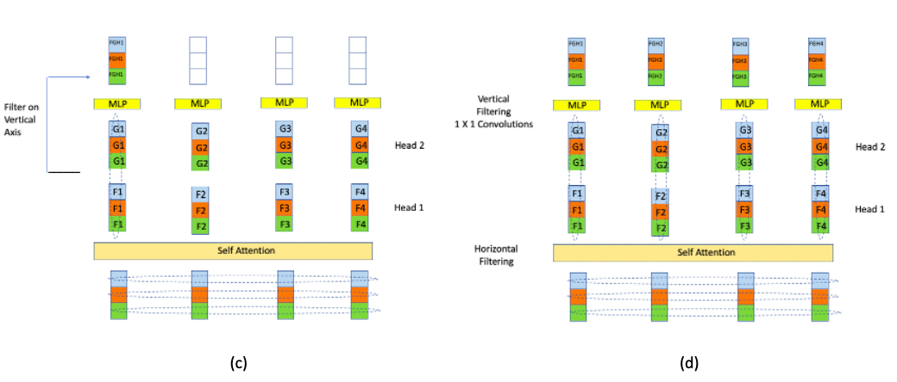

# Transformers

by Subir Varma

## Introduction

*Figure 1*

Transformers are a new kind of Neural Network Architecture, that were introduced in 2017 by [Vaswani et.al.](https://arxiv.org/abs/1706.03762). They were originally targeted at NLP applications, but since then they have been successfully applied to Image Processing as well. In NLP they overcome some of the difficulties with RNN/LSTMs, and result in much improved performance in applications such as Machine Translation. In addition, they are much better at Transfer Learning for NLP, so that Transformer models trained on huge amounts of data can be fine tuned and used for smaller datasets, just like for ConvNets.

Transformers were originally used to do Machine Translation, whereby the name comes from (they "Transform" a sentence in language 1 to language 2). Since then they have been successfully applied to other NLP applications such as Classification and Language Modeling. Indeed it was soon realized that Transformers are a versatile general purpose tool, which can be used in any Machine Learning application, as long as the input can be formatted in a way that can be ingested by them. Recently Transformers have been used for Image Processing tasks, where they have shown themselves to perform better than the best performing ConvNets.

In contrast to older architectures, Transformers have a much higher modeling capacity, which also means it is possible to scale up these models to very large sizes (see Figure 1) with corresponding improvements in performance. Indeed some of the more recent Transformer models have hundreds of billions of parameters, which take days to train even with powerful computing infrastructure. Recall that models with large number of parameters require a correspondingly large amount of training data in order to avoid the overfitting problem. In the case of Transformers this problem was addressed by using self-supervised learning on massive text datasets.

This process, whereby larger and larger models trained on bigger and bigger datasets lead to better and better performance, has not reached its limits yet, indeed the latest Transformer features over a trillion parameters!

## Why RNNs are Not Good Enough

*Figure 2*

Consider the Bi_directional RNN shown in Figure 2: Assuming that the data being fed in the network consists of NLP sequences, with the sequence  $𝑋_𝑖,1\le i\le 𝑁$  being the embedding or representation for the corresponding word sequence. Note that this representation does not take into account the surrounding context from the other words in the sentence. The corresponding hidden state sequence  $𝑍1_𝑖,1\le 𝑖\le 𝑁$ , can be considered to be the new representation for the sequence  $𝑋_𝑖,1\le 𝑖\le 𝑁$ , such that the representation  $𝑍1_𝑖$  is modified by the words  $𝑋_1,...,𝑋_𝑖$  that came at or before  $𝑍1_𝑖$ . In a Bi-Directional RNN, each word  $𝑋_𝑖$  has two such representations, with the representation  $𝑍1_𝑖$  modified by the words  $𝑋_1,...,𝑋_𝑖$ , and the representation $𝑍2_𝑖$  modified by the words  $𝑋_{𝑖+1},...,𝑋_𝑁$ . Can these word representations be further improved? This RNN model has some shortfalls in this area:

RNN representations such as  $𝑍1_𝑖$  or  $𝑍2_𝑖$  for the word  $𝑋_𝑖$  are most influenced by other other words that are in  $𝑋_𝑖$ 's immediate neighborhood. The influence from words that are further away becomes progressively smaller due to the Vanishing Gradient problem (this is less of an issue in LSTMs, but the problem does not completely go away). It is well known that word sentences contain patterns that are strongly non-local, and this is not well captured by the RNN/LSTM type models.

Lack of Parallelizability: Note that future RNN states cannot be computed before past RNN states have been computed. This is a significant restriction, since modern GPUs are capable of performing multiple independent computations at the same time. This causes a significant slowdown when training on very large datasets.

In order to develop better NLP models, it is important to come up with systems that are able to develop even better context dependent representations for words by allowing all the words in a sequence to interact with each other.

Just as NLP models can be improved by allowing better interactions between all the words in a sentence, as opposed to only the nearby words, it turns out that exactly the same reasoning can be applied to Image Processing as well. If we replace the word embeddings in NLP by patch embeddings in Image Processing (as we will see later in this chapter), then ConvNets can be considered to be a special type of model in which only the neighboring patches are allowed to influence each others representations. Better Image Processing models can be developed which allow ALL the patches in an image to interact with each other, which is the main idea behind a class of Transformer models for Image Processing called Vision Transformers (or ViT).

## Introducing Self Attention ##

*Figure 3*

When we introduced the concept of Attention in the previous chapter (see Figure **rnn65** in Chapter **NLP**), it was in the context of the Encoder-Decoder architecture, with Attention being used so that the words in the Encoder can influence the representation of words in the Decoder. This was referred to as **Cross Attention**. We are going to take this idea and modify it in a way such that the Attention mechanism can be used to allow words in the same sentence to modify each others representations, which is called **Self Attention**. 

A possible way in which this can be done is shown in Figure 3. The figure shows the embedded word sequence in the bottom layer followed by two layers of Self Attention. In each Self Attention layer, the representation of each of the words is modified by every other word in the sequence by using the Self Attention mechanism (an example of the connections from one of the words is shown, but the same connections exist for all the other words as well). This process can be repeated with multiple layers, with the output of layer $i$ serving as the input to layer $i+1$, as shown in the figure. The idea behind this architecture is that after several layers of Self Attention, each word develops a representation that takes into account all the other words that exist in the sentence. The exact calculations used to implement Self Attention are described in detail in the following section. Also note that the calculations for each of the words proceeds independently up the stack, which means that unlike RNNs, the words in the entire input sequence can be processed in parallel.

The idea of multilayer Self Attention as shown in the figure may remind you of the Dense Feed Forward Networks (DFN) that we encountered several chapters ago, with its dense node to node connections and multiple layers. Indeed, if we were to replace the embedding vectors with scalars (ignoring the attention calculations for a moment), then it becomes identical to the DFN architecture. From this perspective, the Multilayer Self Attention architecture can be considered to be an extention of the DFN architecture to 2D tensor or vector inputs. Hence instead of starting with a scalar sequence and transforming it with matrix multiplications in each layer (as in DFNs), we start with a vector sequence, and use the Attention mechanism to transform it into another vector sequence. This raises the interesting possibility that there should be other ways in which vector inputs can be transformed. Indeed, in addition to RNNs and LSTMs, we have already come across two ways in which this can be done:

- By using regular 2D ConvNets: We can treat the vector sequence as an 'image' and then process it by using a 2D ConvNet in the usual way

- By using 1D ConvNets: This is a more natural way to process vector sequences, and indeed in Chapter **ConvNets Part 1** we saw that their performance is close to that of LSTMs when processing NLP data.

The existence of so many different ways of processing vector sequences shows that the common factor in all these designs, is a way in which the individual elements of a vector can be mixed, in both column-wise and row-wise axes, and there are multiple ways in which this can be done. What sets the Transformer apart from all these other ways of processing vectors is the fact that they have a much higher model capacity with the ability to scale up to models with hundreds of billions of parameters. This allows them to capture and model much more complex patterns. The amount of complexity in language data or image data is such that LSTM or ConvNet models are not able to capture all the interconnected patterns that exist in them and thus are capacity limited. 

## Transformer Architecture

*Figure 4*

A Transformer consists of a set of identical modules that are stacked in a serial fashion. Note that each module has its own set of parameters. The block level structure of each module, as shown in Figure 4(a), consists of a Self-Attention layer followed by a Feed Forward layer. Part (b) of Figure 4 show the progress of an input sequence (of vectors) as it traverses a module. The input $(x_1,x_2)$ is first processed by the Self Attention layer and results in the sequence $(z_1,z_2)$. This is further processed by the Dense Feed Forward Layer and the sequence $(r_1,r_2)$ is the final output for this layer. Note that each member of the sequence is propagated separately through the Self Attention and Dense layers and weight parameters are shared across all of them (each Encoder Layer has its own set of parameters though). The calculations for $x_1$ as it goes up the stack are independent from those for $x_2$, so both can proceed in parallel.

Lets first examine the Self Attention layer in greater detail:

*Figure 5*

In Figure 5 we show how to go from the input $X_3$ to the output $Z_3$ of the Self Attention layer. Note that $Z_3$ is a measure of the Self Attention that $X_3$ pays to the other vectors $(X_1, X_2)$ in the input sequence. The simplest way to compute the Self Attention between two vectors is by taking their dot product, and this was the technique used for RNN based Cross Attention in the prior chapter. If we carry out this procedure, then the Self Attention between vectors $X_i$ and $X_j$ is given by $A_{ij} = X_i\cdot X_j$. These numbers can then be converted into weights 

$$ w_{ij} = {{e^{A_{ij}}}\over{\sum_j{e^{A_{ij}}}}},\ \ i,j = 1,2,...,N $$

The output vector $Z_{i}$ is computed as a weighted sum of the input vectors $X_i$

$$
Z_{i} = \sum_j w_{ij} X_j
$$

This procedure represents the core of Self Attention based approach and it worked well for the RNN Cross Attention design, but note that it has the following drawback: There are no learnable parameters in these computations. We would give the Neural Network more flexibility (and thus greater capacity) if we were to change the procedure in a way that allows the network to modify the weights $w_{ij}$ during the course of the training process. In order to so, we define a new Self Attention procedure, fundamental to which are the following three vector sequences:

- Queries $(Q_1,Q_2,...,Q_N)$: The Query $Q_i$ for the $i^{th}$ input, represents the focus of Attention when this input is being processed, and is used to compare the $i^{th}$ input to all the other inputs.
- Keys $(K_1,K_2,...,K_N)$: The Key $K_j$ for the $j^{th}$ input is used to compare this input with the current focus of Attention.
- Values $(V_1,V_2,...,V_N)$: Instead of applying Self Attention to the input $(X_1,X_2,...,X_N)$ directly, it is first converted into another sequence $(V_1,V_2,...,V_N)$, called the Value Sequence. This sequence is used to compute the output for the current focus of attention.

The three sequences are derived from the input sequence $(X_1,...,X_N)$ by means of linear transformations with learnable weights.  

- The Queries $(Q_1,Q_2,...,Q_N)$ are generated from the Encoder inputs by multiplication of the inputs $(X_1,X_2,...,X_N)$ with a Query matrix $W^Q$.

- The Keys $(K_1,K_2,...,K_N)$ are generated by multiplying the input $(X_1,X_2,...,X_N)$ by the Key Matrix $W^K$.

- The Values $(V_1,V_2,...,V_N)$ are generated by multiplying the input $(X_1,X_2,...,X_N)$ by the Value Matrix $W^V$.

Note that these transformations are equivalent to taking each of the vectors $X_i, i = 1,...,N$ and passing them through three separate Dense Feed Forward Networks $W^Q, W^K$ and $W^V$, as shown in Figure **trans2**.

Each of the vectors $X_i$ is of dimension $1\times d$, while $W^Q, W^K$ and $W^V$ are of dimensions $d\times d$. The contents of these matrices are parameters that are estimated using Gradient Descent during the training process. Once we have computed the Queries, Keys and Values, the Self Attention computation for the $i^{th}$ input $X_i$ proceeds as follows:

1. Compute a scalar valued Score $s_{ij},\ j=1,2,...,N$ associated with the $i^{th}$ and $j^{th}$ inputs by taking the inner product

$$  s_{ij} = Q_i K_j,\ \ j=1,2,...,N   $$

The Score value is a measure of the similarity between these two vectors.

2. Normalize the Score values by dividing by $\sqrt{d}$ to create the sequence $S_{ij}, j=1,2,...,N$. 

$$  S_{ij} = {{Q_i K_j}\over{T}}  \ \ j=1,2,...,N   $$

This can be considered to be a type of Normalization in order to keep the results of the dot product between the Query and Key vector under control. Without this, there is danger that the dot product may become very large (or very small), which in combination with the exponentiation in the softmax (the following step) leads to numerical issues and problems in gradient propagation.

3. The normalized Scores are used to generate scalar weights $w_{ij}$ by using the Softmax function

$$
w_{ij} = {{e^{s'_{ij}}}\over{\sum_j{e^{s'_{ij}}}}},\ \ j=1,2,...,N
$$

4. The Self Attention output vector $Z_{i}$ for the $i^{th}$ input is computed as a weighted sum of the Value vectors

$$
Z_{i} = \sum_j w_{ij} V_j
$$

Since each of the outputs $Z_i$ can be computed independently, these calculations can be parallelized by using matrix multiplication, as follows: The vector sequence $(X_1,...,X_N)$ is packed into a matrix $X\in R^{N\times d}$, such that the $i^{th}$ row of $X$ represents the vector $X_i$. We then multiply $X$ by the matrices $W^Q, W^K$ and $W^V$, each of which are of dimension $d\times d$, to produce matrices $Q, K, V$ of dimensions $N\times d$:

$$
Q = XW^Q, \ \ K = XW^K, \ \ V = XW^V
$$

These three matrices contain all of the Query, Key and Value vectors. By using them, the calculations in steps 1 to 4 can be reduced to a single step:

$$
Z = softmax({QK^T\over{\sqrt{d}}}) V
$$

Note that the output vector $Z_i$ is the $i^{th}$ row of this matrix.

## Multiple Attention Heads

*Figure 6*

The Attention weight $w_{ij}$ for the $i^{th}$ input $X_i$ is a measure of how important the $j^{th}$ input $X_j$ is in the calculation of the Self-Attention $Z_i$, which is the new representation for $X_i$. Note that this captures only one set of dependencies between the $i^{th}$ input and all the other inputs. Just as an image has multiple patterns whose capture requires multiple ConvNet filters, the Transformer model uses multiple Attention weights (and thus multiple Self-Attention values) in order to capture other dependencies between the $i^{th}$ and the other inputs. 

As shown in Figure 6, Multiple Attention Heads are implemented with the help of $H$ versions of the Query, Key and Value matrices: $(W^Q_1,...,W^Q_H),\ (W^K_1,...,W^K_H)$ and $(W^V_1,...,W^V_H)$, each of which are of dimension $N\times{d\over H}$. These are then used to compute $H$ Self Attention matrices, given by $(Z^1,...,Z^H)$, using the same computations as before, each of which are of dimension $N\times{d\over H}$. In order to generate a single output value, these $H$ matrices are first concatenated together to create a $N\times d$ matrix $\zeta = Z^1 || Z^2||... || Z^H$, followed by multiplication with another matrix $W^O$ in order to compute the final output $Z$:

$$
Z = \zeta W^O
$$

If the matrix $W^O$ is chosen to be of dimension $d\times d$, then this results in a final Attention vector of the same size as when only one Attention Head was being used. This also means that there is no increase in either the number of parameters or amount computation in implementing additional Heads. In the original Attention paper $d = 768$ and $H = 10$.

**Note:** Some Self Attention implementations, such as the one that is in Keras, do not do this truncation of the individual Attention Head matrices, instead choosing to stick to the original dimensions for each of the Attention Heads. This results in a $\zeta$ matrix of size $N\times dH$, which is then multiplied by a $W^O$ matrix of size $dh\times d$ to produce the $Z$ matrix of the right size, $N\times d$.

## A Complete Transformer Block

*Figure 7*

Figure 7 shows a complete Encoder Layer. In addition to the Self-Attention Layer, it includes the following:

**Residual Connection + Layer Normalization:** 

As shown in the figure, each Encoder block has two Residual Connections, one around the Self Attention Layer, and the other around the Dense Feed Forward Layer. As in ResNets,each of these Residual Connections does a bypass from the input to the output of these two layers, and the vectors at either end are added together. In addition to facilitating gradient flow during backprop, these connections also create four separate paths through the Encoder Layer in the forward direction. These two properties together enable very deep networks that are nevertheless trainable, and create an Ensemble like effect when making decisions.

Each of the two Residual Connections is followed by Layer Normalization. Batch Normalization works by normalizing one feature at a time, across a batch. Layer Normalization on the other hand, carries out Normalization across features in a single training sample, as opposed to a batch. As shown below, normalization is done by computing the mean and standard deviation for the elements in a single vector.

$$\mu_L =  \frac{1}{d}\sum_{m=1}^{d}a(m)  $$

$$ \sigma_L^2 = \frac{1}{d}\sum_{m=1}^d (a(m)-\mu_L)^2 $$

 $$ \hat{a}(m) = \frac{a(m)-\mu_L}{\sqrt{\sigma_L^2+\epsilon}} $$
 
 $$ c(m) = \gamma\hat{a}(m) + \beta $$

Layer Normalization was introduced by [Ba, Kiros,Hinton](https://arxiv.org/abs/1607.06450) and works better in Transformers than Batch Normalization.

**Dense Feed Forward Layer:** 

The output of the first Layer Normalization is fed into a Dense Feed Forward Layer. The computation carried out by this layer is as follows:

$$
R_i = ReLU(Z_iW_1 +b_1)W_2 + b_2,\ \ i =1,...,N
$$

Hence each of the vectors $Z_1,...,Z_N$ is processed independently by two DFN layers, with ReLU being applied only after the first layer. Note that all of DFNs in a layer share the same parameters, however the DFN parameters differ across layers. In the original paper, the $W_1$ matrix was of dimension $d\times 4d$, while the $W_2$ matrix was of dimension $4d\times d$. Hence the output of the DFN layer is set of vectors $R_1,...,R_N$ each of which are of dimension $1\times d$.

The output of this layer is subjected to another round of Residual connection + Layer Normalization before generating the final output of the Encoder Layer $R_i, i=1,2,...,N$. The addition of the DFN layer accomplishes the following:

-  It introduces a non-linearity into the model. This is important since the Self Attention layer does not have any non-linearities.

- It serves as a mechanism for the mixing within a 'channel' and also introduces an 'inverted bottleneck' into the architecture. This is further explained in a following section.

*Figure 8*

The set of vectors $(R_1,R_2,...,R_N)$ are then passed through another Self Attention + Dense layer, as shown in Figure 8, and this process is repeated $P$ times to finally generate the output of the Encoder Block.

The computations in a single Encoder Block can be summarized as:

$$
Z = LayerNorm(X + SelfAttn(X))
$$

$$
R = LayerNorm(Z + DFN(Z))
$$

## Computing Number of Parameters in a Transformer Model

*Figure 9*

## Encoding Position Information in Transformers

*Figure 10*

The Transformer architecture was originally designed to process sequences, however note that the desciption provided so far works the same regardless of the order of the input data (you can see this for yourself by shuffling the input sequence and running it through the model). This is unlike RNN/LSTMs or even 1D ConvNets, where the order of the input changes the corresponding output. Hence we need to make some changes to the Transformer design in order to make it sensitive to the order of the input sequence. The original Transformer paper had a scheme whereby another pre-computed sequence was added to each input sequence, such that the second sequence was sensitive to the order. This was done by making the vector elements of the second sequence a function of sines and cosines with varying frequencies. 

We now describe a simpler scheme that achieves the same purpose and is used more commonly in practice. As shown below, we create two embedded sequences for each input:

- The original Embedded Sequence that creates word embeddings for the words in each input IMDB review

- A new Embedded Sequence that creates position imbeddings from an input that is a sequence of integers from 0 to sequence_length. Hence each of the integers gets converted into a vector that takes the sequence order into account.

These two sequences are then added together to create the final input that is then fed into the Transformer, as shown in Figure 10.

## Visualizing Attention Patterns in Transformers

It has been shown (https://towardsdatascience.com/deconstructing-bert-distilling-6-patterns-from-100-million-parameters-b49113672f77) that RNN type processing forms a subset of Attention type processing, i.e., the recurrent connections that we hardwire into a RNN emerge naturally in Attention networks as a result of training. Some figures from this article are reproduced in Figure **rnn99**. This study was done for a type of Transformer Encoder model called BERT (we will describe this model in a later section). Also note that there are two input sentences input into the model, which are separated using a special token call SEP. Also the beginning and the end of the input are appended with special tokens CLS and SEP.  In these figures, the input sentence is the one on the right hand side, while the left hand side is the representation of the corresponding words after self-attention. The lines represent the attention weights, with a thicker line indicating a higher weight. For example in Part (a) of the figure, the representation of the (first) "I" assigns the greatest weight to the following word "went".

Note that the Transformer model used had multiple layers, with multiple heads in each layer. The layer number is shown at the top left of each figure, while the attention head is the highlighted color in the strip at the top of the figures.

*Figure 11*

There are some interesting patterns that emerge in the self-attention patterns of this Transformer:

- The Self-Attention pattern in Part (a) shows that all the Attention is being paid to the **next** word in the sequence. This is identical to the hardwired connections that are used in backwards RNNs. This pattern is broken by the SEP tokens, which focus their attention to the CLS token.

- The Self-Attention pattern in Part (b) shows that most of the Attention is being paid to the **prior** word in the sequence. This is identical to the hardwired connections that are used in forward RNNs. The Attention is somewhat diffuse compared to Part (b), some of the Attention is also distributed among other words in the input sentence.

- The Self-Attention pattern in Part (c) shows that most of the Attention is being paid to words in the sequence that are identical to the input word. If a word occures only once, then this results in the horizontal line.

- The Self-Attention pattern in Part (d) seems to pay equal attention to all the words that are in the **same** sentence.

Hence the usual backward and forward recurrent connections emerge naturally in a trained Transformer. In addition the Transfomer incorporates other types of connections that are non-local and can span the entire sequence, which results in the higher modeling capacity in these models. 

*Figure 12*

Figure 12 shows all the different attention patterns that exist in a trained Transformer Encoder with 6 layers, with 12 heads in each layer. We can see that the model is able to capture a wide variety of Attention patterns, with some of the patterns repeating from layer to layer (analogous to a multi-layer RNN). There is also a "Null" pattern that exists especially in the higher layers, with attention focused on the SEP or CLS tokens. This pattern seems to indicate that the model has not found a meaningful pattern for a Attention Head, so is defaulting to the Null pattern.

## Relationship between Transformers and Depthwise Separable ConvNets

The Transformer design was originally inspired by the Cross Attention mechanism used in RNNs. Indeed the Transformer does have a lot of aspects that it shares with RNNs, such as the fact that both architectures were designed to process vector sequence data in a modular fashion with a mechanism that enables members of the sequence to influence each others representation. However, it turns out that Transformers have a lot in common with Depthwise Separable Convolutions (that we first encountered in Chapter **Convolutional Networks Part 2**). Indeed as shown next, Transformers can be considered to be a way in which ConvNets with their superior filtering capabilities have been merged with RNNs with their superior ability to handle sequential data, to create a new architecture that has the best aspects of both.

*Figure 13*

Lets start by re-visiting the Depthwise Separable 1D ConvNet design, which has been reproduced in Figure 13. It shows four vectors, each of dimension three, being processed by a Depthwise 1D ConvNet, with data passing from bottom to top of the figure. The three features in the vectors are color coded as shown. The processing happens in two stages:

-  In the first stage, a 1D Convolution is applied to each Feature Plane, with a different filter used for each of the features. These filters are marked F1, F2 and F3 in the figure. The output of this stage is once again 4 vectors, in which the each feature is now a filtered version of the original features. The "blue" features in the second layer for example were obtained by filtering the corresponding "blue" features in the input using filter F1.

- In the second stage each of the individual vectors are processed using a 1 X 1 Convolution to obtain the final output. Note that a 1 X 1 Convolution is the same as processing using a DFN (or MLP as they are also called). 

Hence the processing using a 1D Depthwise Separable ConvNet can be considered to be made up of two types of filtering (1) Filtering along the "horizontal" axis (using the 1D Convolution), followed by filtering along the "vertical" axis (using the DFN). Using the terminology used in image processing, the horizontal axis is called the feature plane, while the vertical axis is called the channel plane.

It turns out that Transformers are structured along similar lines, as we show next.

*Figure 14*

Earlier in this chapter we presented the computation of the representation $Z_1$ of a vector $X_1$ in Transformers, as a result of the Self-Attention operation. However, as shown in Figure **trans27** this computation can also be considered to be a *filtering* operation, as evidenced by the equation:

$$
Z_{i} = \sum_j w_{ij} X_j
$$

Hence $w_{ij}$ can be considered to be filter coefficents rather than Self Attention weights, with the caveat that these filters are now a function of the data. Since the co-efficents are the same for all the elements in the output $Z_1$, lets call it Filter $F_1$,  it results in the figure shown in Part (a). Similarly the elements in $Z_2$ are generated by using a second Filter $F_2$ and so on.

Comparing Figures 13 and 14, we can see that the elements $Z_i$ are generated in each case using a filtering operation, though the exact details by which the filtering is done differs for the two networks. The important point to take away from this is that in both cases we are 'mixing' together the elements of the vectors along the feature axis.

The reader may have noticed that in 1D ConvNets (see Figure 13), the elements in $Z_1$ are generated by using 3 different filters, while all the elemnts in the corresponding $Z_1$ in Transformers (see Figure 14) are generated using the same filter. This weakness in the Transformer architecture is addressed multiple Heads as shown in Figure 15 below. Since each Transformer Head uses a different set of filters, we are able to reproduce the multiple filter aspct of 1D ConvNets.

*Figure 15*

Figure 15 shows the DFN part of a Transformer Encoder, with its filtering along the channel axis and as shown in Figure 13, this exact operation is also carried out in 1D Convnets, with the caveat that multiple vectors are mixed in Transformers, vs a single vector in a 1D ConvNet,

Hence both 1D ConvNets and Transformers involve two types of filtering or mixing:

- Filtering along the Feature axis, followed by
- Filtering along the Channel axis.

The filtering along the Channel axis is identical in the two architectures, however note that the Feature axis filtering is local in the ConvNet, while it spans the entire sequence in the Transformer. This is one of the reasons why Transformers have higher capacity than ConvNets, since they are able to detect non-local patterns.

Since the discovery of Transformers, researchers have discovered other ways of processing vector sequences in a non-local fashion with filtering along these two axes, with performance that is comparable to Transformers. Two examples of this are:

- The paper by [Lee-Thorpe et.al.](https://arxiv.org/pdf/2105.03824.pdf) in which the Fast Fourier Transform was used instead of Self Attention

- The paper by [Tolstikhin, Houlsby et.al.](https://arxiv.org/abs/2105.01601), in which they use multiple DFNs in each layer instead of Self Attention

## Language Models using Transformers

Language Models were defined in Chapter **LLM** as way to predict the next word in a sequence. As a result they can be used to generate new language sequences, which is very useful in applications such as Translation or Summarization. In this Section we modify the Transformer Encoder model so that it can be used as a Language Model. 

Language Models using Transformers have made a big impact on NLP in the last few years. In particular a Language Model called GPT (Generalized Pre-Trained Transformer) from OpenAI has garnered a lot of attention due to the realistic text that it is able to generate. This model also inaugurated a new era in Deep Learning, by defining a new class of models called Large Language Models or LLMs. The largest of these models have tens of billions of parameters, and require millions of dollars to train on huge training datasets. Fortunately these datasets do not require manual labeling, since the labels are auto-generated (as the next word in a sentence), which is referred to as Self Supervised Learning. In addition, LLMs exhibit the following useful properties: 

- Pre-trained models can be reused for new datasets, while retaining their good performance, i.e., Transfer Learning works very well with LLMs, unlike RNNs or LSTMs.
- It has also been observed that the pre-trained LLMs can give very good results with very small datasets, sometimes as little as single example. This is referred to as One-Shot-Learning and is an active area of research.
- LLMs also exhibit Emergent Properties, such as the ability to answer general questions (such who was the first President of the USA), almost like a Q&A service. This has led to proposals for using LLMs as an interface into Search Engines. This is also an active area of research.
- LLMs have been in used in Text to Image models such as DALLE and Imagen, which have garnered a lot of attention recently.

*Figure 16*

The main difference between the Transformer used as Language Model, and the Transformer described earlier in this chapter, is that when a sentence is fed into a Language Model Transformer during training, then the Attention calculations for word $x_i$ cannot take into account words that occur after $x_i$. This is illustrated in Figure 16: For example the Attention calculations for $x_3$ can take into account $x_3$ itself as well as $x_1$ and $x_2$, but not $x_4$ and $x_5$. 

*Figure 17*

In order implement this restriction, we make the following change to the Transformer model: Recall that the output of the Self Attention layer is computed using the formula

$$
Z = softmax({QK^T\over{\sqrt{d}}}) V
$$

where the matrix $QK^T$ contains the results of the vector dot products. As shown in Figure 17, if the upper half of this matrix is set to -infinity, then row $i$ exhibits the correct dot product for computing the Self Attention for the $i^{th}$ term in the input sequence.

The mathematical operation described above is called masking, and is implemented in Keras using the *mask* argument.

*Figure 18*

Figure 18 shows a Transformer based Language Model during the Training phase. Note that the entire training sentence can be fed into the model in one shot once we have the masking in place. This is in contrast to RNN/LSTMs in which words had to fed in sequence, one at a time. Ths figure also shows that the labels used for each word, is simply the following word in the sequence.

### Text Completion using Language Models

*Figure 19*

While Figure 18 showed a Transformer based Language Model during training, Figure 19 shows the model being used to generate new text, once it has been trained. The model is prepped using a sentence starter <*so long and thanks for*>, and is reponsible generating the words that follow. Note that the model operates in an auto-regressive manner, with each generated word fed back into the model in order to generate the next word.

## Summarization using Transformer based Language Models

*Figure 20*

Figure 20 shows how a Transformer based Language Model can be used to do Text Summarization:

- During the training phase, the original article and its summary are concatenated together as shown, with a special word inserted as a delimiter between the two. The training is done exactly as for the regular Language Model, with the model trying to predict the next word in the summary

- During the test phase, the article to be summarized is fed into the model, while it's summary is generated one word at a time, in an auto-regressive fashion

The Language Model based design used for summarization can also be used for other NLP tasks, such as Machine Translation with the sentence to be translated on the left, and the corresponding translation on the right.

## Encoder-Decoders using Transformers

So far we have described Encoder only Transformers, and showed that they can be used to perform most NLP tasks. The original Transformer paper actually featured an Encoder-Decoder type Transformer of the type shown in Figure 21. It has been shown that both these architectures can be used to perform NLP tasks, and the type to use for a particular application is up to the designer. The Encoder-Decoder design does include an additional feature not found in Encoder only systems, and that is the Cross Attention Layer in the decoder, which is described below.

*Figure 21*

Figure 21 shows the Encoder Decoder Transformer being used to do Machine Translation. It shows that whereas the Input sentence is fed into the Encoder in one shot, the output translation is generated by the Decoder one word at a time (same as in a Language Model). Hence the first vector fed into the Decoder is the token for Start of Sentence "S", and in response it generate the first word "llego". In stage 2, the the tokens for "S" and "llego" are fed into the decoder which in turn leads to the generation of the word "la", and so on until the End of Sentence token is generated. The figure shows the test phase of the model in which the words generated by the Decoder are fed back into it as input in an Auto Regressive fashion. During the test phase the translated phrase is fed into the decoder after passing it through a Mask in order to hide future words.

*Figure 22*

Figure 22 delves deeper into the Encoder Decoder architecture and shows the following:

- The Encoder is the same as described previously, consisting of multiple Encoder Block layers.

- The Decoder consists of multiple Decoder Blocks. Each Decoder Block is similar to an Encoder Block since it also contains Self-Attention and Dense Feed Forward layers. But in addition, it also has an Cross-Attention layer that connects the Encoder with the Decoder.

- The Encoder output $(h_1,...,h_n)$ is packed into a matrix $H^{enc} = (h_1,...,h_n)$. We then multiply $H^{enc}$ by the Cross-Attention Key and Value matrices $W^K$ and $W^V$, to produce matrices $K, V$ :
- 
$$ K = H^{enc}W^K, \ \ V = H^{enc}W^V $$

  The Query vector $Q$ on the other hand is computed from the output of the prior decoder Self-Attention layer:
  
$$
Q = H^{dec[i-1]}W^Q
$$

The output of the Cross-Attention layer is given by

$$
Z = softmax({QK^T\over{\sqrt{d}}}) V
$$

As a result of the Cross-Attention layer, each of the Decoder Blocks has full access to all the ouputs of the Encoder.

## BERT: Bi-Directional Language Models

The Transformer Encoder based Language Model that was described earlier in this chapter, was characterized by a training scheme whereby the model was tasked with predicting the next word in the training sequence. As a result of this, the word representations that the model generated, were influenced by the words that came before a particular word in the sequence. However, the meaning of a word clearly depends not only on words that come before it, but also words that come after it in a sentence. For example:

*The bank of the river was very green and shady*

*Bob deposited the check in the bank*

Hence it should be possible to get better word representations by taking into account **all** the words in a sequence, as opposed to opposed to only prior words. This was the main motivation behind the model called BERT, which stands for Bi-Directional Encoder Representations from Transformers. The Self Attention Layer in a BERT model is shown in Figure 23, and the reader may notice that it is nothing more than the Transformer Self Attention Layer. Hence the Self Attention calculation for each of the input words takes into account all the other words in the sequence. The resulting system is referred to as a **Masked Language Model** or MLM.

*Figure 23*

The novelty in the BERT model was the technique used for training the system, which is illustrated in Figure 24. Instead of trying to predict the next word in the sequence, BERT tries to predict missing words, which can occur anywhere in the sequence. The actual scheme used is a little more sophisticated, and works as follows: Up to 15% of the words in a sequence are randomly selected for prediction. Out of these, 80% of the words are replaced by a special MASK token, 10% of the words are left unchanged and the remaining 10% are replaced by a randomly selected word. For example in the figure below, the words 'long' and 'thanks' are replaced by the MASK token, while the word 'apricot' is replaced by 'the'. This scheme was designed to mitigate the mismatch between training sequences and the sequences used during fine-tuning, since the latter do not use the MASK token. The usual Cross Entropy Loss is used to do the prediction for the selected words.

*Figure 24*

In addition to the masked word prediction method, there was another technique that was proposed in a model called SpanBERT, which tries to predict words located within a span of missing words, as shown in Figure 25. Since several Language Modeling tasks involve identification or classification of parts of a sentence, this training technique has been shown to improve their performance. The span based training works as follows: The length of the span is chosen randomly by sampling from a geometric distribution, and is limited to 10 words or less. The start of the span is randomly selected using a uniform distribution. The Loss Function used to predict a word occuring within the span is the sum of two loss functions:

- The first Loss Function is simply the Cross Entropy Loss associated with the word being predicted
- The second Loss Function is computed using the word immmediately preceding the span AND the word immediately following the span, augmented with a position token for the location of the missing word within the span.

Once again up to 15% of the words are selected for prediction within a sequence, and as before the missing words may be replaced by the MASK token, a randomly selected word or the word itself (in the ration 80:10:10).

*Figure 25*

BERT's training so far has focused on obtaining the best representation for a word as a function of the other words in the sequence. However there are certain NLP tasks that have to do with finding relationships between pairs of sentences. In order to improve BERT's performance for these tasks, the following additional training scheme was added: The model is fed with two sentences, and it is tasked to determine whether the second sentence follows the first (see Fig **trans29**). The training dataset consists of 50% samples in which two successive sentences are fed into the model, while the remaining 50% consist of pairs of un-related sentences. In order to facilitate this training, the following changes are made: Two additional tokens CLS and SEP are added to the input, with CLS pre-pended to the first sentence and SEP inserted after the first sentence and also after the end of the second sentence. In addition to the Word Token and Positional Embeddings, another embedding called the Segment embedding is added which indicates whether a word is part of the first or second sentence.
The output vector corresponding to the CLS token is used for doing the sentence classification. This vector is passed through a dense layer W_NSP followed by a binary softmax based classifier.

*Figure 26*

One of the important benefits of Transformer based models such as BERT is that after being trained using self-supervised learning methods, they can be tuned to individual tasks using supervised learning. These tasks typically have much smaller training datasets. In order to train the model, the model is initialized with the parameters of a fully trained self supervised system, and then further fine-tuned in a supervised manner using the smaller dataset. This is an example of **Transfer Learning** which we encountered earlier with ConvNet based Image Processing systems. Until the advent of Transformers, earlier sequence processing models such as RNN/LSTMs were not very good at Transfer Learning, so this has been an important advance in the state of the art.

Figure 27 shows how BERT can be used to do sentiment classification using a pre-trained model. The CLS token is inserted at the start of the sequence, and then the output vector corresponding to CLS is used for classification. The model is then fine-tuned using the training dataset with labeled sentences.

*Figure 27*

## Image Processing using Transformers

After Transformers proved to be adept at NLP tasks, the focus shifted to trying them out for Image Processing tasks. Just as ConvNets can be used to process 2D language data, Transformers can also be adapted to process 3D image data. In order to do so the 3D image tensor has to be transformed into a sequence of 2D vectors before being fed into the Transformer model. The performance of the resulting system, called Vision Transformer or ViT [Dosovitskiy et.al, (2021)](https://arxiv.org/abs/2010.11929), has been shown to be better than that of the best performing ConvNet, which seems to point to the conclusion that the filtering in the Self Attention architecture also subsumes that used for ConvNets. Indeed it has been shown by [Cordonnier, Loukas, Jaggi](https://arxiv.org/abs/1911.03584) that the local filtering in ConvNets arises naturally in ViT networks as a result of training. The disadvantage of using Transformers for images is that much larger dataset is required for training, since Transformers don't make any assumptions about the locality of patterns. 

The critical design decision in the ViT model was to decide what aspect of an image should be used to replace the word vectors used as NLP model input. The most straightforward choice would be to use the pixel vectors (for intance along the channel axis). However given the large number of pixels in a typical image, this leads to un-acceptably high computation load in the Attention layers. The initial attempts at Image Processing Transformers focused on trying to reduce this computation load by various techniques, such as local self-attention around the query vector. The ViT model achieved the critical break-through by using image patches instead, as explained next. 

The finding that Transformers are good at Image Processing opens up the possibility of using Transformer models for doing multi-modal pressing, i.e., being able to handle not just language data but also images, sound, video etc. 

*Figure 28*

The main idea behind ViT is quite simple and illustrated in Figure 28. Given an input image X of shape $R^{H\times W\times C}$, where $C$ is the number of channels and $H$ and $W$ are the dimensions of the image in pixels, sub-divide it into a sequence of flattened 2D patch vectors, which is of shape $R^{N\times P^2 C}$. Each of the patch vectors is obtained by dividing the original image into image patches of size $P\times P\times C$ as shown in the figure, so that there are $N = {HW\over P^2}$ image patches in all. Each image patch is then flattened to create $N$ patch vectors of size $P^2 C$. These patch vectors are then sent through a learnable embedding layer, and a position embedding is added to them, to create the input into the model. The Transformer model itself is exactly the same as was used for NLP.

*Figure 29*

In order to test this new model, the researchers created three versions of ViT, as shown in Figure 29, with increasing size. We use the notation ViT-L/16 to refer to the "Large" variant, with  16×16  input patch size. Note that decreasing the patch size increases the sequence length into the model, thus making it more computationally intensive.

For comparisons to ConvNets, the researchers used slightly modified versions of ResNets, which is referred to as "ResNet (BiT)".

*Figure 30*

Figure 30 has a comparison of the Transformer models (the colored circles) as well a range of ConvNet models of varying size (in the shaded area). The performance numbers were generated by pre-training the models using the ImageNet dataset (1.3M images with 1K classes), the ImageNet-21 k dataset (14M images with 21K classes) and the JFT-300M dataset (303M images with 18K classes), and then fine tuning it on ImageNet.

The most interesting observation from this graph is that the performance of the ViT models varies very strongly as a function of the training dataset size. Indeed with smallest dataset (ImageNet), the ResNet models outperform all the ViT models. With the intermediate size dataset ImageNet-21k, their performances are about the same, while with the largest dataset, the best ViT model performs better than all the ResNet models. From this we can conclude that the strong inductive prior built into ResNet models, that feature representations are only influenced by nearby features in the neighborhood, works well when the training set is not very large. However for large training sets such as the JFT-300M, learning the relevant attention patterns from the data works as well or better. This conclusion is further re-inforced by the results in Figure 31 which shows the performnce of the models on random subsets of JFT-300M which are increasing in size. The performance of the ResNet models starts out better than ViT models, but flattens out for larger datasets. ViT models on the other hand show progressively improving performance with larger datasets and larger models, which opens up the possibility that with increasing compute resources even better performance can be achieved.

The researchers also showed that the compute resources required for training ViT models is 2-4x less compared to ResNet models, for comparable levels of performance. For example it took about 2.5K TPUv3-core-days to train the ViT-H/14 model, while the BiT-L Resnet model took 9.9K.

*Figure 31*

Figure 32 illustrates another very important aspect of ViT models: It is a plot of the Attention weights $w_{ij}$ in the ViT model, as a function of the Network Depth (or layer index). It shows the extent to which the patch vector at any particular position, is influenced by other patch vectors in the sequence. The plot illustrates that in the early layers, the query patch is already paying attention to patches that are far it, indeed it seems to be paying attention across a broad spectrum of all the patches in the sequence. In later layers on the other hand, the Attention seems to focused more on patches that are further away. This behavior is in contrast to that in ConvNets, in which the convulation in the early layers is influnced solely by pixels that are in the immediate neighborhood. As a result of this, the ViT is able to take into account aspects of the input image that are located further away from the query patch, thus allowing it to detect global patterns in the image that are invisible to the ConvNet. This is especially useful in applications such as object detection, where a global view can be very useful.

*Figure 32*

